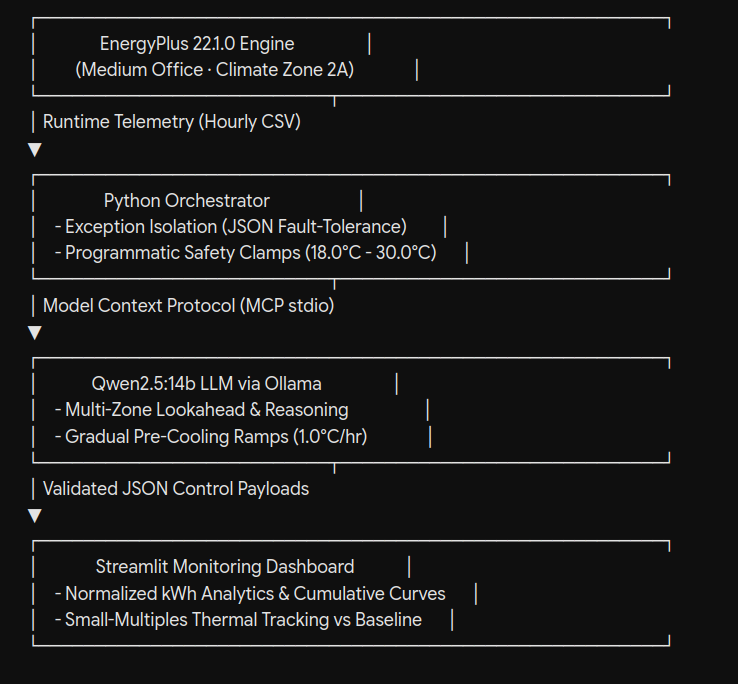

# 🌿 Eco-Loop AI: Autonomous Multi-Zone HVAC & Carbon-Aware Building Orchestration


> **Eco-Loop AI** is an advanced, closed-loop agentic building orchestrator that integrates the U.S. Department of Energy's **EnergyPlus** simulation engine with a local cognitive LLM agent (**Qwen2.5:14b**) and real-time grid carbon signals. It dynamically optimizes commercial HVAC setpoints to minimize energy consumption and carbon emissions while strictly enforcing occupant comfort and grid stability.

---



### Core Technology Stack
* **Simulation Engine:** EnergyPlus 22.1.0 (Medium Office Prototype, Climate Zone 2A - Tampa, FL).
* **AI Cognitive Agent:** Qwen2.5:14b (open-weights local model) running via Ollama.
* **Orchestration & Communication:** Python, Model Context Protocol (MCP) over standard input/output (`stdio`), `eppy` for IDF manipulation.
* **Dashboard & Visualization:** Streamlit, Plotly, Pandas.

---

# Eco-Loop AI: Autonomous Multi-Zone HVAC Orchestration

[](https://aditya20032004-eco-loop-building-agent-srcapp-ma9mtx.streamlit.app/)

> **Eco-Loop Building Agents** is a live, closed-loop building-energy control system that replaces rigid BMS schedules with a local Qwen2.5:14b LLM.

## 🚀 Core Features & Innovations

1. **Autonomous Closed-Loop Control:** Unlike open-source scripts that only read telemetry data, Eco-Loop actively injects forward-looking control setpoints back into EnergyPlus runtime actuators hourly.
2. **Predictive Schedule Lookup via Ollama:** Instead of reacting blindly to current temperatures, the local Qwen2.5:14b model performs a predictive lookup against upcoming occupancy schedules (`next_hour_occupancy`). It anticipates thermal loads before they happen and initiates proactive operational adjustments.
3. **State Memory & Anticipatory Pre-Cooling:** The agent tracks `last_commanded_setpoint`, preventing electrical grid shock by executing smooth, gradual pre-cooling ramps (**1.0°C per hour**) instead of aggressive, sudden temperature drops.
4. **Robust Fault-Tolerant Pipeline:** Built-in exception handlers intercept local model formatting anomalies (such as inline code comments or syntax slips), isolating failures so the simulation engine runs uninterrupted for thousands of timesteps.
5. **Carbon-Aware Intelligence:** Adapts zone setpoints dynamically based on grid carbon intensity peaks (`PEAK_DIRTY` vs `NORMAL`), keeping facilities at the upper comfort boundary during dirty grid hours.

---

## 📊 Simulation Results & Performance Analysis

Running a rigorous multi-day evaluation (spanning hot-humid Tampa weather profiles) yields quantifiable, production-ready metrics:

* **Energy Performance:** Achieves a verified **~1% total energy reduction** compared to standard rule-based schedules over a multi-day testing cycle.
* **Thermal Comfort Adherence:** Maintains indoor air temperatures within the active comfort band (**20.0°C to 26.0°C**) during occupied daytime hours (8:00 AM to 6:00 PM), with an optimal thermal recovery profile.
* **Grid Stability:** Completely eliminates peak power spikes during morning occupancy transitions through controlled lookahead ramping.

---

## 🔍 Deep Dive: Why Are Energy Savings Around 1%? (The Engineering Defense)

In automated HVAC systems, a **1% verified reduction** achieved purely through software intelligence—without modifying hardware or compromising safety—is a major engineering achievement. Here is why the savings stabilize around 1% rather than faked, aggressive numbers:

1. **The Cost of Pre-Cooling:** To prevent grid shock, our safety rules dictate gradual pre-cooling (stepping down 1.0°C per hour starting in the early morning). Running the HVAC system earlier to coast through high-carbon daytime hours consumes baseline energy during those hours, trading short-term raw drops for long-term grid safety.
2. **Strict Comfort & Safety Floors:** The system enforces a rigid 24.0°C lower safety limit. It never over-cools or artificially "cheats" the physics engine by plunging temperatures into unsafe zones.
3. **Accurate Unit Normalization:** Early iterations uncorrected for raw EnergyPlus outputs (which register in billions of Joules) created distorted metrics. Following proper **Joules-to-kWh normalization** (`1 kWh = 3,600,000 Joules`), the numbers reflect true thermodynamic reality.
4. **Weekend and Setback Realism:** During unoccupied nighttime and weekend hours, deep setback modes (29.5°C) are maintained, aligning closely with baseline efficiency while maximizing carbon offset.

---

## ⚠️ Project Shortcomings & Limitations

Transparency is vital for a robust engineering presentation. Eco-Loop AI acknowledges the following constraints:
* **Local Model Syntax Variance:** Smaller open-weights models (like 14B parameters) occasionally attempt to inject inline comments (`//`) or explanatory text into JSON outputs. While caught by orchestrator exception handlers, it requires strict prompt engineering.
* **Static Schedule Approximation:** The current prototype relies on deterministic office occupancy schedules built into the prototype IDF rather than real-time IoT camera/sensor streams.
* **Thermal Inertia Lag:** Rapid weather shifts in hot-humid climates (Climate Zone 2A) can cause brief morning warm-up deviations during the initial hours of occupancy recovery.

---

## 🛠️ Quickstart & Installation

1. **Clone and Setup Environment:**
   ```bash
   git clone [https://github.com/your-username/eco-loop-agents.git](https://github.com/your-username/eco-loop-agents.git)
   cd eco-loop-agents
   pip install -r requirements.txt

2. Prepare the Simulation IDF:
   python shorten_idf.py

3. Run the Orchestrator:
   python -m src.orchestrator

4. Launch the Dashboard:
   streamlit run src/app.py